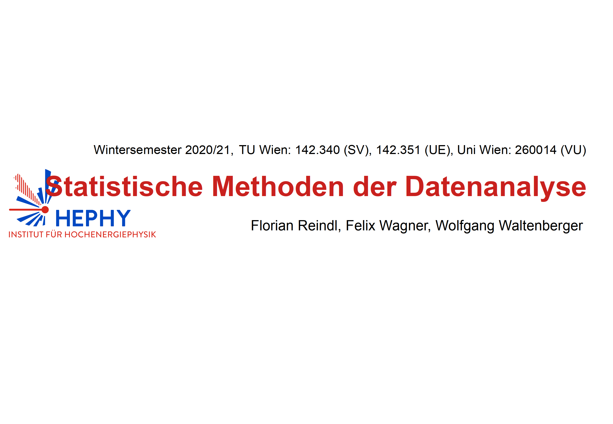

# Statistische Methoden der Datenanalyse

 * [YouTube channel](https://www.youtube.com/WolfgangWaltenberger)
 * [slides](Folien.pdf)
 * [Pruefungsmodalitaeten](pruefungsmodalitaeten.pdf)
 * [Themen fuer moegliche Projekt-, Bachelor, und Masterarbeiten](projektthemen.pdf)
